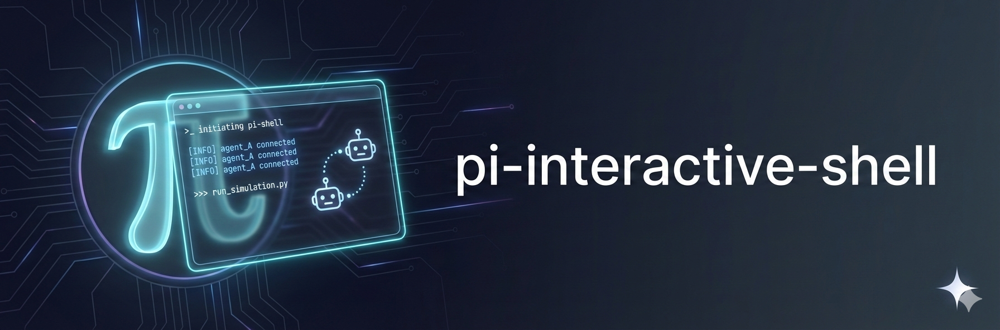

<p>
  
</p>

# Pi Interactive Shell

An extension for [Pi coding agent](https://github.com/badlogic/pi-mono/) that lets Pi autonomously run interactive CLIs in an observable TUI overlay. Pi controls the subprocess while you watch - take over anytime.

https://github.com/user-attachments/assets/76f56ecd-fc12-4d92-a01e-e6ae9ba65ff4

```typescript
interactive_shell({ command: 'vim config.yaml' })
```

## Why

Some tasks need interactive CLIs - editors, REPLs, database shells, long-running processes. Pi can launch them in an overlay where:

- **User watches** - See exactly what's happening in real-time
- **User takes over** - Type anything to gain control
- **Agent monitors** - Query status, send input, decide when done

Works with any CLI: `vim`, `htop`, `psql`, `ssh`, `docker logs -f`, `npm run dev`, `git rebase -i`, etc.

## Install

```bash
pi install npm:pi-interactive-shell
```

The `interactive-shell` skill is automatically symlinked to `~/.pi/agent/skills/interactive-shell/`.

**Requires:** Node.js, build tools for `node-pty` (Xcode CLI tools on macOS).

## Modes

Three modes control how the agent engages with a session:

| | Interactive | Hands-Free | Dispatch |
|---|---|---|---|
| **Agent blocked?** | Yes — tool call waits | No — returns immediately | No — returns immediately |
| **How agent gets output** | Tool return value | Polls with `sessionId` | Notification via `triggerTurn` |
| **Overlay visible?** | Yes | Yes | Yes (or headless with `background: true`) |
| **User can interact?** | Always | Type to take over | Type to take over |
| **Concurrent sessions?** | No | One overlay + queries | Multiple headless, one overlay |
| **Best for** | Editors, REPLs, SSH | Dev servers, builds | Delegating to other agents |

**Interactive** is the default. The agent's tool call blocks until the session ends — use this when the agent needs the result right away, or when the user drives the session (editors, database shells).

**Hands-free** returns immediately so the agent can do other work, but the agent must poll periodically to discover output and completion. Good for processes the agent needs to monitor and react to mid-flight, like watching build output and sending follow-up commands.

**Dispatch** also returns immediately, but the agent doesn't poll at all. When the session completes — whether by natural exit, quiet detection, timeout, or user intervention — the agent gets woken up with a notification containing the tail output. This is the right mode for delegating a task to a subagent and moving on. Add `background: true` to skip the overlay entirely and run headless.

## Quick Start

### Interactive

```typescript
interactive_shell({ command: 'vim package.json' })
interactive_shell({ command: 'psql -d mydb' })
interactive_shell({ command: 'ssh user@server' })
```

The agent's turn is blocked until the overlay closes. User controls the session directly.

### Hands-Free

```typescript
// Start a long-running process
interactive_shell({
  command: 'npm run dev',
  mode: "hands-free",
  reason: "Dev server"
})
// → { sessionId: "calm-reef", status: "running" }

// Poll for output (rate-limited to 60s between queries)
interactive_shell({ sessionId: "calm-reef" })
// → { status: "running", output: "Server ready on :3000", runtime: 45000 }

// Send input when needed
interactive_shell({ sessionId: "calm-reef", inputKeys: ["ctrl+c"] })

// Kill when done
interactive_shell({ sessionId: "calm-reef", kill: true })
// → { status: "killed", output: "..." }
```

The overlay opens for the user to watch. The agent checks in periodically. User can type anything to take over control.

### Dispatch

```typescript
// Fire off a task
interactive_shell({
  command: 'pi "Refactor the auth module"',
  mode: "dispatch",
  reason: "Auth refactor"
})
// → Returns immediately: { sessionId: "calm-reef" }
// → Agent ends turn or does other work.
```

When the session completes, the agent receives a compact notification on a new turn:

```
Session calm-reef completed successfully (5m 23s). 847 lines of output.

Step 9 of 10
Step 10 of 10
All tasks completed.

Attach to review full output: interactive_shell({ attach: "calm-reef" })
```

The notification includes a brief tail (last 5 lines) and a reattach instruction. The PTY is preserved for 5 minutes so the agent can attach to review full scrollback.

Dispatch defaults `autoExitOnQuiet: true` — the session is killed after output goes silent (5s by default), which signals completion for task-oriented subagents. Opt out with `handsFree: { autoExitOnQuiet: false }` for long-running processes.

The overlay still shows for the user, who can Ctrl+T to transfer output, Ctrl+B to background, take over by typing, or Ctrl+Q for more options.

### Background Dispatch (Headless)

```typescript
// No overlay — runs completely invisibly
interactive_shell({
  command: 'pi "Fix all lint errors"',
  mode: "dispatch",
  background: true
})
// → { sessionId: "calm-reef" }
// → User can /attach calm-reef to peek
// → Agent notified on completion, same as regular dispatch
```

Multiple headless dispatches can run concurrently alongside a single interactive overlay. This is how you parallelize subagent work — fire off three background dispatches and process results as each completion notification arrives.

### Timeout

Capture output from TUI apps that don't exit cleanly:

```typescript
interactive_shell({
  command: "htop",
  mode: "hands-free",
  timeout: 3000  // Kill after 3s, return captured output
})
```

## Features

### Auto-Exit on Quiet

For fire-and-forget single-task delegations, enable auto-exit to kill the session after 5s of output silence:

```typescript
interactive_shell({
  command: 'cursor-agent -f "Fix the bug in auth.ts"',
  mode: "hands-free",
  handsFree: { autoExitOnQuiet: true }
})
```

For multi-turn sessions where you need back-and-forth interaction, leave it disabled (default) and use `kill: true` when done.

### Send Input

```typescript
// Text
interactive_shell({ sessionId: "calm-reef", input: "SELECT * FROM users;\n" })

// Named keys
interactive_shell({ sessionId: "calm-reef", inputKeys: ["ctrl+c"] })
interactive_shell({ sessionId: "calm-reef", inputKeys: ["down", "down", "enter"] })

// Bracketed paste (multiline without execution)
interactive_shell({ sessionId: "calm-reef", inputPaste: "line1\nline2\nline3" })

// Hex bytes (raw escape sequences)
interactive_shell({ sessionId: "calm-reef", inputHex: ["0x1b", "0x5b", "0x41"] })

// Combine text with keys
interactive_shell({ sessionId: "calm-reef", input: "y", inputKeys: ["enter"] })
```

### Configurable Output

```typescript
// Default: 20 lines, 5KB
interactive_shell({ sessionId: "calm-reef" })

// More lines (max: 200)
interactive_shell({ sessionId: "calm-reef", outputLines: 100 })

// Incremental pagination (server tracks position)
interactive_shell({ sessionId: "calm-reef", outputLines: 50, incremental: true })

// Drain mode (raw stream since last query)
interactive_shell({ sessionId: "calm-reef", drain: true })
```

### Transfer Output to Agent

When a subagent finishes work, press **Ctrl+T** to capture its output and send it directly to the main agent:

```
[Subagent finishes work]
        ↓
[Press Ctrl+T]
        ↓
[Overlay closes, main agent receives full output]
```

The main agent then has the subagent's response in context and can continue working with that information.

**Configuration:**
- `transferLines`: Max lines to capture (default: 200)
- `transferMaxChars`: Max characters (default: 20KB)

### Background Sessions

Sessions can be backgrounded by the user (Ctrl+B, or Ctrl+Q → "Run in background") or by the agent:

```typescript
// Agent backgrounds an active session
interactive_shell({ sessionId: "calm-reef", background: true })
// → Overlay closes, process keeps running

// List background sessions
interactive_shell({ listBackground: true })

// Reattach with a specific mode
interactive_shell({ attach: "calm-reef" })                      // interactive (blocking)
interactive_shell({ attach: "calm-reef", mode: "hands-free" })  // hands-free (poll)
interactive_shell({ attach: "calm-reef", mode: "dispatch" })    // dispatch (notified)

// Dismiss background sessions
interactive_shell({ dismissBackground: true })               // all sessions
interactive_shell({ dismissBackground: "calm-reef" })        // specific session
```

User can also `/attach` or `/attach <id>` to reattach, and `/dismiss` or `/dismiss <id>` to clean up from the chat.

## Keys

| Key | Action |
|-----|--------|
| Ctrl+T | **Transfer & close** - capture output and send to main agent |
| Ctrl+B | Background session (dismiss overlay, keep running) |
| Ctrl+Q | Session menu (transfer/background/kill/cancel) |
| Shift+Up/Down | Scroll history |
| Any key (hands-free) | Take over control |

## Config

Configuration files (project overrides global):
- **Global:** `~/.pi/agent/interactive-shell.json`
- **Project:** `.pi/interactive-shell.json`

```json
{
  "overlayWidthPercent": 95,
  "overlayHeightPercent": 45,
  "scrollbackLines": 5000,
  "exitAutoCloseDelay": 10,
  "minQueryIntervalSeconds": 60,
  "transferLines": 200,
  "transferMaxChars": 20000,
  "completionNotifyLines": 50,
  "completionNotifyMaxChars": 5000,
  "handsFreeUpdateMode": "on-quiet",
  "handsFreeUpdateInterval": 60000,
  "handsFreeQuietThreshold": 5000,
  "handsFreeUpdateMaxChars": 1500,
  "handsFreeMaxTotalChars": 100000,
  "handoffPreviewEnabled": true,
  "handoffPreviewLines": 30,
  "handoffPreviewMaxChars": 2000,
  "handoffSnapshotEnabled": false,
  "ansiReemit": true
}
```

| Setting | Default | Description |
|---------|---------|-------------|
| `overlayWidthPercent` | 95 | Overlay width (10-100%) |
| `overlayHeightPercent` | 45 | Overlay height (20-90%) |
| `scrollbackLines` | 5000 | Terminal scrollback buffer |
| `exitAutoCloseDelay` | 10 | Seconds before auto-close after exit |
| `minQueryIntervalSeconds` | 60 | Rate limit between agent queries |
| `transferLines` | 200 | Lines to capture on Ctrl+T transfer (10-1000) |
| `transferMaxChars` | 20000 | Max chars for transfer (1KB-100KB) |
| `completionNotifyLines` | 50 | Lines in dispatch completion notification (10-500) |
| `completionNotifyMaxChars` | 5000 | Max chars in completion notification (1KB-50KB) |
| `handsFreeUpdateMode` | "on-quiet" | "on-quiet" or "interval" |
| `handsFreeQuietThreshold` | 5000 | Silence duration before update (ms) |
| `handsFreeUpdateInterval` | 60000 | Max interval between updates (ms) |
| `handsFreeUpdateMaxChars` | 1500 | Max chars per update |
| `handsFreeMaxTotalChars` | 100000 | Total char budget for updates |
| `handoffPreviewEnabled` | true | Include tail in tool result |
| `handoffSnapshotEnabled` | false | Write transcript on detach/exit |
| `ansiReemit` | true | Preserve ANSI colors in output |

## How It Works

```
interactive_shell → node-pty → subprocess
                  ↓
            xterm-headless (terminal emulation)
                  ↓
            TUI overlay (pi rendering)
```

Full PTY. The subprocess thinks it's in a real terminal.

## Advanced: Multi-Agent Workflows

For orchestrating multi-agent chains (scout → planner → worker → reviewer) with file-based handoff and auto-continue support, see:

**[pi-foreground-chains](https://github.com/nicobailon/pi-foreground-chains)** - A separate skill that builds on interactive-shell for complex agent workflows.

## Limitations

- macOS tested, Linux experimental
- 60s rate limit between queries (configurable)
- Some TUI apps may have rendering quirks
